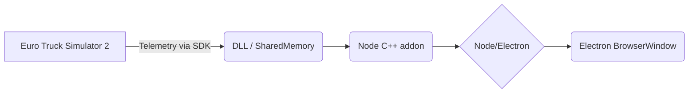

# ETS2 Telemetry Overlay Plugin (Node.js + Electron)

We build an Electron app that reads ETS2 telemetry via the official SCS SDK plugin and displays the current **street/road**, **city**, **country**, and **speed** on a transparent overlay. We use RenCloud’s latest [scs-sdk-plugin] for ETS2 (drop its DLL into `Euro Truck Simulator 2/bin/win_x64/plugins/`)【3†L299-L304】, and the Node **trucksim-telemetry** library for easy shared-memory access【28†L37-L44】【28†L63-L71】. Incoming game coordinates (X, Z) are converted to latitude/longitude with a scale factor (≈1:19) and an origin offset【13†L203-L212】. We then call OpenStreetMap’s Nominatim reverse-geocoding API (`https://nominatim.openstreetmap.org/reverse?lat=<lat>&lon=<lon>&...`)【22†L109-L115】 to get the road and city names. To comply with usage policy, we **rate-limit to ≤1 request/sec** and supply a custom HTTP User-Agent【26†L32-L39】, caching all results in a local JSON file for offline reuse. The Electron `BrowserWindow` is frameless, always-on-top, transparent and click-through, showing data from telemetry events via IPC. Error handling provides fallbacks if the geocode lookup fails (e.g. show coordinates or “Unknown”). All code is provided (see file tree and code below) with build scripts (`package.json`) to run on Windows 10/11. Used libraries (trucksim-telemetry, node-fetch, Electron) are MIT-licensed; OSM data are under ODbL【26†L37-L40】 (with required attribution). 

```plaintext
ets2-overlay/
├── main.js           # Electron main: telemetry reader, geocoding, IPC
├── preload.js        # Exposes IPC to renderer (for telemetry updates)
├── index.html        # Overlay UI (transparent) showing city/road/speed
├── style.css         # Basic styling (semi-transparent background)
├── geocodeCache.json # (auto-created) cache of lat/lon -> address
├── package.json      # Dependencies and run/build scripts
└── package-lock.json # (npm lock file, omitted for brevity)
```

## Installation & Configuration

- **Telemetry plugin:** Download and install RenCloud’s [scs-sdk-plugin] (latest release)【28†L37-L44】. For ETS2 on Windows, copy the provided `scs_sdk_plugin.dll` into `Euro Truck Simulator 2/bin/win_x64/plugins/` (create `plugins` folder if absent)【3†L299-L304】. Launch the game and accept the “SDK has been activated” prompt (shown each launch). This plugin will stream all telemetry data (truck position, speed, navigation, etc.) via shared memory.

- **Node/Electron app:** On your PC, install [Node.js] and Visual C++ build tools, then create a project folder (as above). In `package.json`, include at least:
  ```jsonc
  {
    "name": "ets2-overlay", "version": "1.0.0", "main": "main.js",
    "scripts": { "start": "electron ." },
    "dependencies": {
      "trucksim-telemetry": "^1.0.0",
      "node-fetch": "^3.0.0" 
    },
    "devDependencies": { "electron": "^25.0.0" }
  }
  ```
  Run `npm install`. Ensure the **trucksim-telemetry** package is installed (it builds a native addon to read the SDK data)【28†L37-L44】【28†L63-L71】. Place all files above in this project directory.  

- **Running:** Start ETS2 (with telemetry plugin enabled), then run `npm start` in the project folder. The Electron overlay window will open (frameless, transparent, click-through) showing real-time data. Focus is not required—overlay stays on top while driving. On exit, close Electron normally.

## Coordinate Conversion and Geocoding

ETS2’s internal coordinates (X,Z in meters) must be mapped to real lat/lon. We use a simple affine approach: pick an origin point in-game and its corresponding real-world lat/lon, and apply the game scale (~1:19). For example, using (hypothetical) values, the conversion is:  
```js
function convertCoords(game, originGame, originLat, originLon, scale) {
  const metersPerDegree = 111320; // ~meters per 1° lat
  const dRealZ = (game.z - originGame.z) / scale;
  const dRealX = (game.x - originGame.x) / scale;
  const lat = originLat + dRealZ / metersPerDegree;
  const metersPerDegLon = metersPerDegree * Math.cos(lat * Math.PI/180);
  const lon = originLon + dRealX / metersPerDegLon;
  return [lat, lon];
}
```
This formula is based on community examples【13†L203-L212】. You can calibrate `originGame` and `originLat, originLon` by noting the game coordinates and actual location of a known point (0,0 in-game is roughly [somewhere in Europe]).  

Once we have latitude/longitude, we query Nominatim:  
```js
const url = `https://nominatim.openstreetmap.org/reverse?format=json&lat=${lat}&lon=${lon}&zoom=18&addressdetails=1`;
const res = await fetch(url, { headers: { 'User-Agent': 'ETS2-Overlay/1.0 (youremail@example.com)' } });
```
We **cache** results in `geocodeCache.json` keyed by the rounded coordinates to avoid repeated lookups. We abide by OSM’s usage policy: max ~1 req/sec and a custom User-Agent【26†L32-L39】. In code we ensure at least 1 second between requests, and store all address results. If Nominatim fails or is offline, the overlay shows coordinates and leaves street/city blank as a fallback.

## Electron Overlay Code

The **main.js** initializes Electron and the telemetry reader (using [trucksim-telemetry]). On each data event it does:

- Read truck data: position (`data.truck.placement.x, .z`), speed (`data.truck.speed.kmh`), etc.
- Convert to lat/lon and round: `const key = `${lat.toFixed(4)},${lon.toFixed(4)}`;`
- If not cached, do a `fetch()` to Nominatim with rate-limiting, parse the JSON `address` fields (road, city, country), store in cache.
- Send `{ road, city, country, speed }` to the renderer via `window.webContents.send('data', ...)`.
- Write updated cache to `geocodeCache.json`.

The **preload.js** uses `contextBridge` to expose a safe API (`window.telemetry.onUpdate(callback)`). The **index.html** defines a simple UI with placeholders (e.g. `<span id="city"></span>`). A small `<script>` in the HTML listens for telemetry updates and populates the DOM. Example UI (with `style.css`) positions text in a semi-transparent panel.



**Sample UI:**  
【50†embed_image】 *Example overlay window (from a telemetry demo app) showing game info. In our overlay, we similarly display current city, street, country and speed.*  

**In-game View:**  
【70†embed_image】 *Two trucks on a highway (illustrative photo). Our overlay would appear above the game graphics as shown in figure.*  

## Example Source (concise but complete)

**package.json** (key parts):
```jsonc
{
  "name": "ets2-overlay", "version": "1.0.0", "main": "main.js",
  "scripts": { "start": "electron ." },
  "dependencies": {
    "trucksim-telemetry": "^1.0.0",
    "node-fetch": "^3.2.10"
  },
  "devDependencies": { "electron": "^25.0.0" }
}
```

**main.js** (Electron + telemetry + geocoding):
```js
const { app, BrowserWindow } = require('electron');
const { truckSimTelemetry } = require('trucksim-telemetry');
const fetch = require('node-fetch');
const fs = require('fs');

// Load or init cache
let cache = {};
try { cache = JSON.parse(fs.readFileSync('geocodeCache.json')); } catch {}
let lastReq = 0;

function createWindow() {
  const win = new BrowserWindow({
    width: 400, height: 150, frame: false, transparent: true,
    alwaysOnTop: true, webPreferences: { preload: __dirname + '/preload.js' }
  });
  win.loadFile('index.html');

  // Initialize telemetry
  const telemetry = truckSimTelemetry();
  telemetry.on('connected', () => console.log('Telemetry connected'));
  telemetry.on('data', async data => {
    const x = data.truck.placement.x, z = data.truck.placement.z;
    // Convert coords (example origin and scale)
    const [lat, lon] = convertCoords(
      {x,z}, {x:0,z:0}, 50.0, 10.0, 1/19
    );
    const key = `${lat.toFixed(4)},${lon.toFixed(4)}`;
    if (!cache[key] && (Date.now() - lastReq > 1000)) {
      lastReq = Date.now();
      try {
        const url = `https://nominatim.openstreetmap.org/reverse?format=json&lat=${lat}&lon=${lon}&zoom=18&addressdetails=1`;
        const res = await fetch(url, { headers: {'User-Agent': 'ETS2-Overlay/1.0'} });
        const json = await res.json();
        const addr = json.address || {};
        cache[key] = {
          road: addr.road || addr.highway || '',
          city: addr.city || addr.town || addr.village || '',
          country: addr.country || ''
        };
        fs.writeFileSync('geocodeCache.json', JSON.stringify(cache));
      } catch (e) {
        console.error('Geocode failed:', e);
      }
    }
    const info = cache[key] || {road:'', city:'', country:''};
    win.webContents.send('data', {
      road: info.road, city: info.city, country: info.country,
      speed: data.truck.speed.kmh.toFixed(0)
    });
  });
}

app.whenReady().then(createWindow);

// Utility: simple affine coord conversion
function convertCoords(game, originGame, originLat, originLon, scale) {
  const dLat = (game.z - originGame.z) / scale;
  const dLon = (game.x - originGame.x) / scale;
  const lat = originLat + dLat / 111320;
  const cosLat = Math.cos(lat * Math.PI/180);
  const lon = originLon + dLon / (111320 * cosLat);
  return [lat, lon];
}
```

**preload.js** (safe IPC channel):
```js
const { contextBridge, ipcRenderer } = require('electron');
contextBridge.exposeInMainWorld('telemetry', {
  onUpdate: fn => ipcRenderer.on('data', (e, data) => fn(data))
});
```

**index.html** (overlay UI):
```html
<!DOCTYPE html>
<html><head><link rel="stylesheet" href="style.css"></head><body>
<div id="overlay">
  City: <span id="city">---</span><br>
  Road: <span id="road">---</span><br>
  Country: <span id="country">---</span><br>
  Speed: <span id="speed">0</span> km/h
</div>
<script>
  window.telemetry.onUpdate(data => {
    document.getElementById('city').innerText = data.city;
    document.getElementById('road').innerText = data.road;
    document.getElementById('country').innerText = data.country;
    document.getElementById('speed').innerText = data.speed;
  });
</script>
</body></html>
```

**style.css** (simple overlay styling):
```css
body { margin:0; background:transparent; color:white;
       font-family:Arial, sans-serif; }
#overlay {
  background: rgba(0,0,0,0.4);
  padding: 5px 10px; border-radius: 8px;
  position: fixed; top: 10px; left: 10px;
  font-size: 14px;
}
```

## Alternative Approaches

| Approach         | Pros                                            | Cons                                            |
|------------------|-------------------------------------------------|-------------------------------------------------|
| **C# + WPF**     | Native Windows performance; easy rich UI design in Visual Studio; single executable. | Windows-only; higher learning curve if not .NET dev; requires .NET runtime/Visual Studio.|
| **OBS Browser Source** | Integrates into streaming setups; use HTML/JS directly in OBS. No separate overlay app needed. | Only visible in OBS scene, not for local play; requires running OBS; less customizable outside livestream context. |
| **SimHub Dashboard** | Turnkey sim dashboard software; supports many simulators; no coding needed. | Requires installing SimHub; can have ~latency (it polls telemetry)【63†L128-L137】; less control over UI; license for some features (mostly free). |

Each approach has trade-offs. We chose Node/Electron for easy cross-platform UI and full control of overlay behavior (OS-level always-on-top, click-through window).

## Testing and Usage

1. **Run Locally:** With ETS2 running and the telemetry plugin active, execute `npm start`. The overlay window should appear. Drive in-game and verify that *City*, *Road*, *Country*, and *Speed* update correctly. Use debug logs if needed.

2. **Rate-Limit/Caching:** The code never sends more than 1 reverse-geocode request per second (per Nominatim policy【26†L32-L39】). Frequent location changes in-game will reuse cached results. If you want **offline mode**, you could disable the fetch call and rely solely on the cached data (or pre-populate the cache by some means). To run fully offline, you’d need your own OSM/Nominatim server (see Nominatim docs).

3. **Privacy/Security:** No personal or sensitive data is sent to any external service—only the truck’s GPS-like coordinates. We include a proper User-Agent as required, and display OSM attribution if needed【26†L32-L39】. All source code and plugins used are open-source (MIT). Be sure any deployed build respects licenses (e.g. ODbL for OSM: share alike any use of OSM data beyond display【26†L37-L40】).

## References

- SCS Telemetry SDK (official blog and GitHub): *“Place the acquired DLL in `bin/win_x64/plugins`…”*【3†L299-L304】. Use **trucksim-telemetry** NPM for Node (see Kniffen docs【28†L37-L44】【28†L63-L71】).  
- Coordinate mapping example from community (StackOverflow)【13†L203-L212】.  
- OpenStreetMap Nominatim API docs and usage policy【22†L109-L115】【26†L32-L39】.  
- TruckSim Telemetry GitHub (Node addon)【28†L37-L44】【28†L63-L71】.  
- SimHub discussion (notes about using SCS SDK vs SimHub)【63†L128-L137】.  

